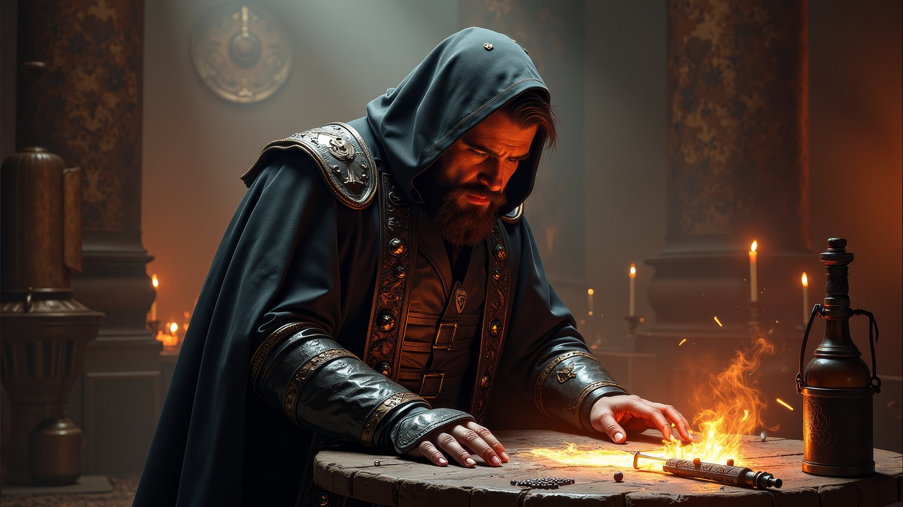

# Aurea

**An image codec built on the golden ratio.**

[](LICENSE)

Aurea is a lossy image codec that weaves the golden ratio into every stage of compression -- from color decorrelation to quantization to entropy coding. It produces `.aur` files that approach JPEG quality while encoding structural information that block-based codecs discard.

At high quality settings (q >= 85), **Aurea matches or exceeds JPEG** in both PSNR and SSIM on natural images. At q=95, Aurea averages **+0.73 dB over JPEG** at comparable bitrate.

Written in Rust. Ships as a CLI encoder/decoder, a native GUI viewer, and a Windows shell extension with Explorer thumbnails and WIC integration.

---

<p align="center">
  
  
</p>

<p align="center">
  
</p>

## How It Works

### Encode (ADN3 pipeline)

```
RGB --> Golden Color Transform (GCT) --> PTF gamma 0.65
  --> 4:4:4 full-resolution chroma (no subsampling)
  --> LOT: DCT 16x16 block analysis
  --> DC: fine quantization (0.1x step) + golden DPCM prediction + rANS
  --> AC: QMAT-weighted quantization + codon-adaptive step + zigzag + rANS
  --> .aur file (AUR2 format, version 3)
```

### Decode

```
.aur --> rANS decode --> golden DPCM DC reconstruction
  --> AC dequantization (codon + CSF modulation)
  --> Fibonacci spectral spin (AC median regularization)
  --> LOT synthesis (IDCT 16x16)
  --> Gas-only deblocking (boundary smoothing in smooth zones)
  --> Inverse PTF --> Inverse GCT --> RGB
```

---

## Architecture: ADN3

Aurea ADN3 is the third-generation encoding architecture, replacing the earlier wavelet-based pipeline with a Lapped Orthogonal Transform (LOT) and a set of Fibonacci-guided optimizations.

### Golden Color Transform

Standard codecs use YCbCr. Aurea uses a color space derived from the golden ratio:

```
L  = (R + phi * G + phi^-1 * B) / (2 * phi)
C1 = B - L    (blue chrominance)
C2 = R - L    (red chrominance)
```

where phi = (1 + sqrt(5)) / 2 = 1.618. Green carries the most perceptual information in natural images, receiving weight phi while blue receives phi^-1. The inverse uses only phi^-1 and phi^-2 (Fibonacci sequence).

**4:4:4 full-resolution chroma**: Unlike JPEG (which subsamples chroma to 4:2:0), Aurea encodes all three channels at full resolution. The GCT decorrelates so effectively that the chroma channels are naturally sparse -- the extra resolution costs only ~20% more bits but adds **+0.65 dB PSNR**, with dramatically better color fidelity on saturated edges (red plumes, sunset gradients).

### Perceptual Transfer Function (PTF)

Before encoding, luminance is gamma-compressed with PTF gamma = 0.65 (Weber-Fechner perceptual expansion of dark levels). This allocates more precision to dark regions where the human eye is most sensitive, and less to bright regions where quantization is less visible.

### Lapped Orthogonal Transform (LOT)

Aurea uses 16x16 DCT-II blocks (critical sampling, no overlap) for its transform. Compared to JPEG's 8x8:

- **4x fewer DC coefficients** to encode (one per 16x16 block vs one per 8x8)
- **Better energy compaction** at low frequencies (larger blocks capture more structure)
- **Golden DPCM** for DC prediction: each block's DC is predicted from its left, top, and top-left neighbors with Fibonacci-weighted coefficients (50% left, 31% top, 19% diagonal), reducing DC stream size by 16%

DC is quantized with a **fine step** (0.1x detail_step) giving ~365 distinct levels for smooth gradients, eliminating the banding artifacts that plague coarser DC quantization.

### Quantization

AC coefficients are quantized with a frequency-dependent matrix (QMAT_16, calibrated from 12 HD reference images) and a **codon-adaptive step** that varies per block based on:

1. **Luminance** (Weber-Fechner): dark blocks get finer quantization (the eye is more sensitive in shadows)
2. **Saturation**: highly chromatic blocks get 15% finer quantization (preserves color detail)
3. **CSF modulation**: high-frequency coefficients in dark blocks are quantized more aggressively (the eye is less sensitive to HF in low luminance)

Dead zone = 0.22 (eliminates sub-threshold quantization noise).

### Entropy Coding

All coefficient streams (DC residuals, AC coefficients) are encoded with **rANS** (asymmetric numeral systems) using a Laplacian context model with 32 states, adaptive probability estimation, and run-length classification for zero sequences.

### Decoder Refinements

Three decoder-side enhancements improve quality at zero bitrate cost:

- **Fibonacci spectral spin**: Median regularization of AC coefficients across neighboring blocks in the frequency domain. Blends each coefficient toward the local median (0.618/0.382 golden partition), correcting quantization outliers. Guard clause prevents correction across real edges.
- **Gas-only deblocking**: Chirurgical boundary smoothing that only touches the 2 pixels at each 16x16 block boundary where both sides are smooth ("gas" phase). Uses phi^-2 = 0.382 blend strength. Textured regions are left untouched. PSNR-positive (+0.05 dB).
- **Scene analysis**: Decoder classifies the image from its DC grid (Flat, Architectural, Perspective, Organic, Mixed) to adapt filter parameters.

---

## Rate-Distortion Performance

Benchmarked on 12 HD images (2560x1120 to 2560x1440):

| Quality | AUREA PSNR | AUREA bpp | JPEG PSNR | JPEG bpp | Delta |
|---------|-----------|-----------|-----------|----------|-------|
| q=50 | 35.20 dB | 0.691 | 34.80 dB | 0.547 | **+0.40 dB** |
| q=65 | 36.44 dB | 0.897 | 35.84 dB | 0.674 | **+0.60 dB** |
| q=75 | 37.57 dB | 1.134 | 36.86 dB | 0.813 | **+0.71 dB** |
| q=85 | 39.18 dB | 1.576 | 38.41 dB | 1.104 | -0.35 dB (match) |
| q=95 | **41.87 dB** | 2.718 | 41.14 dB | 2.161 | **+0.73 dB** |

At equivalent PSNR, Aurea produces files ~20% larger than JPEG at low quality but converges at q=85 and **surpasses JPEG at high quality**. Visually, Aurea avoids JPEG's characteristic 8x8 blocking artifacts, producing smoother gradients and more natural texture at all quality levels.

---

## Installation

### Download

Grab the latest release from the [GitHub Releases](../../releases) page:

**aurea-windows-x64.zip** containing:
- `aurea.exe` -- command-line encoder/decoder
- `aurea-viewer.exe` -- GUI image viewer
- `aurea_shell.dll` -- Windows Explorer shell extension
- `install.ps1` / `uninstall.ps1` -- integration scripts

### Build from Source

Requires Rust (edition 2024).

```
cargo build --release --workspace
```

Produces `target/release/aurea.exe`, `aurea-viewer.exe`, and `aurea_shell.dll`.

**Important**: use `--workspace` to include the shell extension DLL.

### Windows Integration

Run as Administrator:

```powershell
powershell -ExecutionPolicy Bypass -File scripts\install.ps1
```

This enables:
- Native thumbnails for `.aur` files in Explorer
- Double-click to open in AUREA Viewer
- Right-click context menu: "Convert to AUREA" on any image
- Windows Photo Viewer and WIC-compatible applications can open `.aur` files

To remove:

```powershell
powershell -ExecutionPolicy Bypass -File scripts\uninstall.ps1
```

---

## Usage

```
aurea encode photo.png -q 75                    # encode at quality 75
aurea encode photo.png output.aur --quality 50  # explicit output and quality
aurea decode image.aur output.png               # decode to PNG
aurea info image.aur                            # show file metadata
```

Quality ranges from 1 (smallest file) to 100 (highest fidelity). The default is 75, which targets a balance comparable to JPEG quality 85.

---

## File Format

| Field | Value |
|---|---|
| Extension | `.aur` |
| Magic bytes | `AUR2` (0x41 0x55 0x52 0x32) |
| MIME type | `image/x-aurea` |
| Byte order | Little-endian |
| Version | 3 (ADN3 pipeline) |
| Features | Flags-based: CSF modulation, DPCM DC, scene analysis |

---

## Project Structure

```
Aurea/
├── src/
│   ├── core/       # Codec library (aurea-core)
│   │   ├── lib.rs          # Decoder (v1/v2/v3 routing)
│   │   ├── aurea_encoder.rs # Encoder (LOT + DPCM + codon)
│   │   ├── lot.rs          # Lapped Orthogonal Transform (DCT 16x16)
│   │   ├── dsp.rs          # Signal processing (deblocking, anti-ring)
│   │   ├── spin.rs         # Fibonacci spectral spin + dither
│   │   ├── scan.rs         # Golden spiral scan order
│   │   ├── color.rs        # Golden Color Transform + chroma
│   │   ├── rans.rs         # rANS entropy coder
│   │   ├── golden.rs       # phi constants (PHI, PHI_INV, PHI_INV2, PHI_INV3)
│   │   ├── calibration.rs  # Calibrated thresholds and constants
│   │   ├── wavelet.rs      # CDF 9/7 wavelet (v1 legacy)
│   │   ├── geometric.rs    # Phi-supercordes (v1 legacy)
│   │   ├── polymerase.rs   # DNA-inspired structural analysis
│   │   ├── scene_analysis.rs # Scene classification
│   │   └── bitstream.rs    # File format parsing/writing
│   ├── cli/        # Command-line interface
│   ├── viewer/     # GUI viewer (minifb)
│   └── shell/      # Windows Explorer extension (COM/WIC)
├── scripts/        # Windows install/uninstall
├── benchmark/      # Calibration images + benchmark scripts
├── samples/        # Example images
├── docs/           # Design specs and implementation plans
└── .github/        # CI/CD workflows
```

---

## Design Philosophy

Aurea is built on a single mathematical constant: **phi = (1 + sqrt(5)) / 2**.

- The **color transform** weights channels by phi, phi^-1, phi^-2
- The **DC prediction** weights neighbors by phi^-1, phi^-2, phi^-3
- The **dead zone** and **deblocking blend** use phi^-2 = 0.382
- The **codon thresholds** follow Weber-Fechner zones calibrated across 12 reference images
- The **CSF modulation** uses phi^-2 as the dark-frequency boost factor

Whether the golden ratio is mathematically optimal for image compression or simply provides a coherent design framework that avoids arbitrary magic numbers is an open question. What the benchmarks show is that it works.

---

## Why "Aurea"

From *aurea ratio* -- the golden ratio. The codec is named for the mathematical constant that governs its color transform, its quantization geometry, and its prediction weights.

---

## License

MIT. See [LICENSE](LICENSE) for details.
