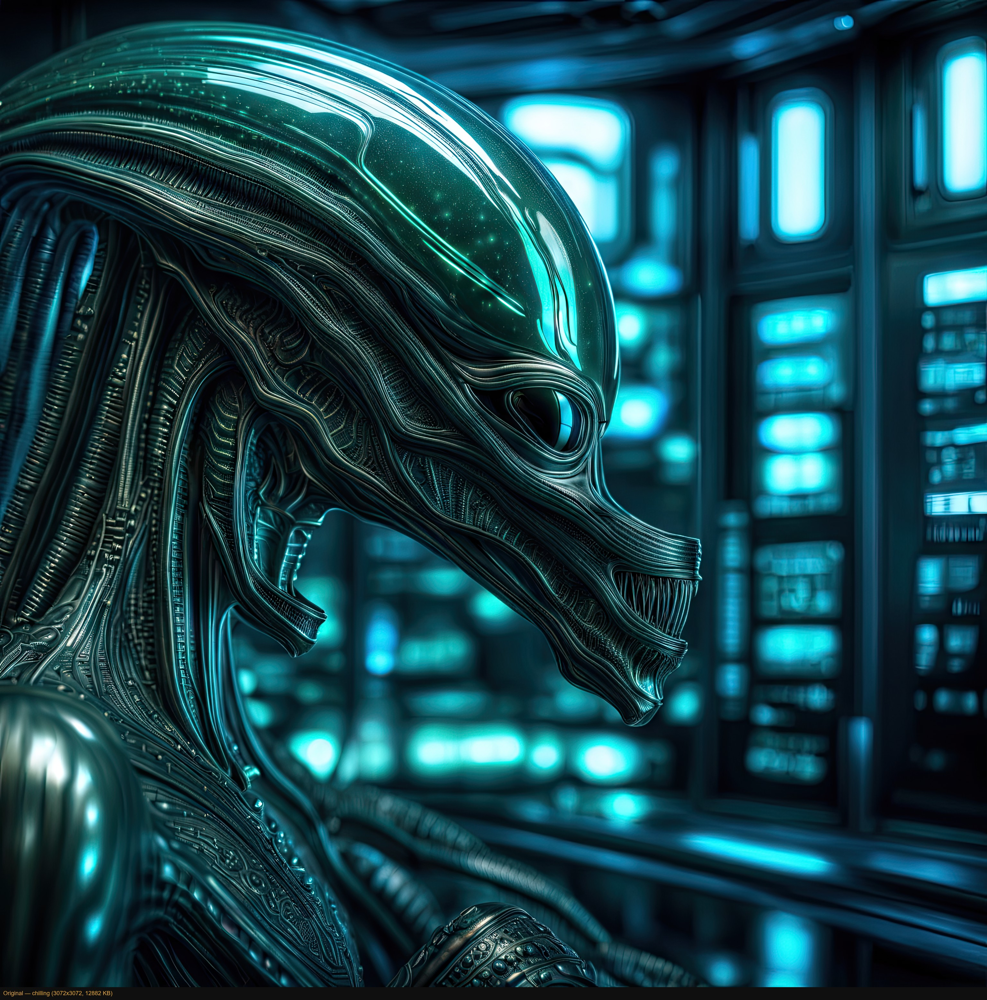
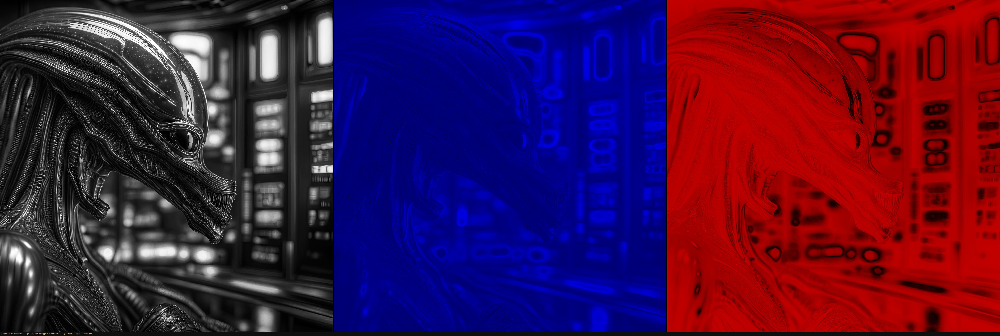
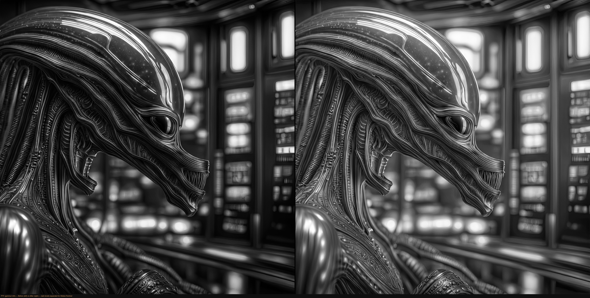
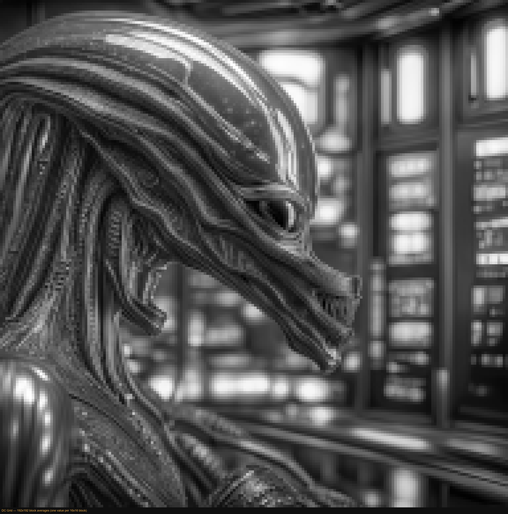
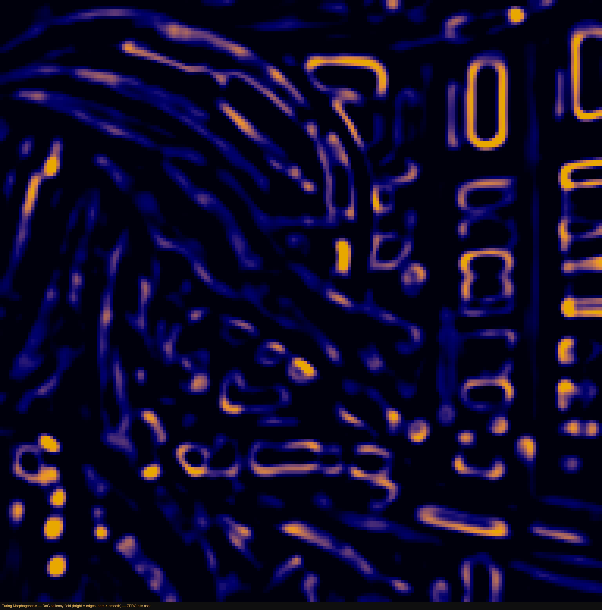
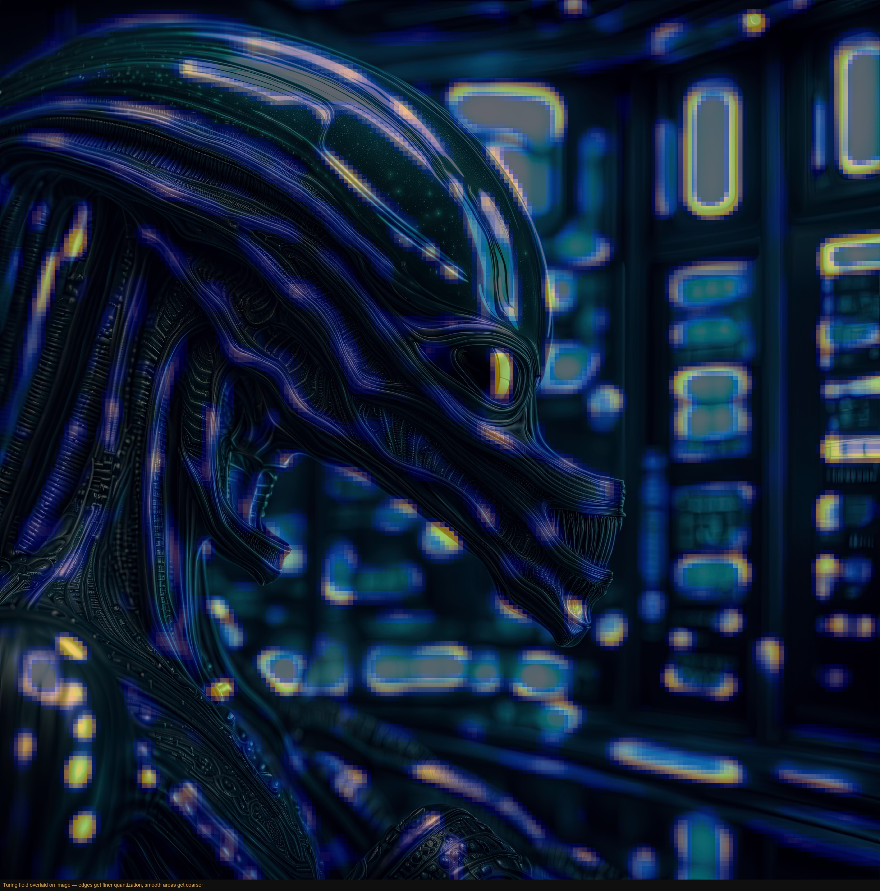
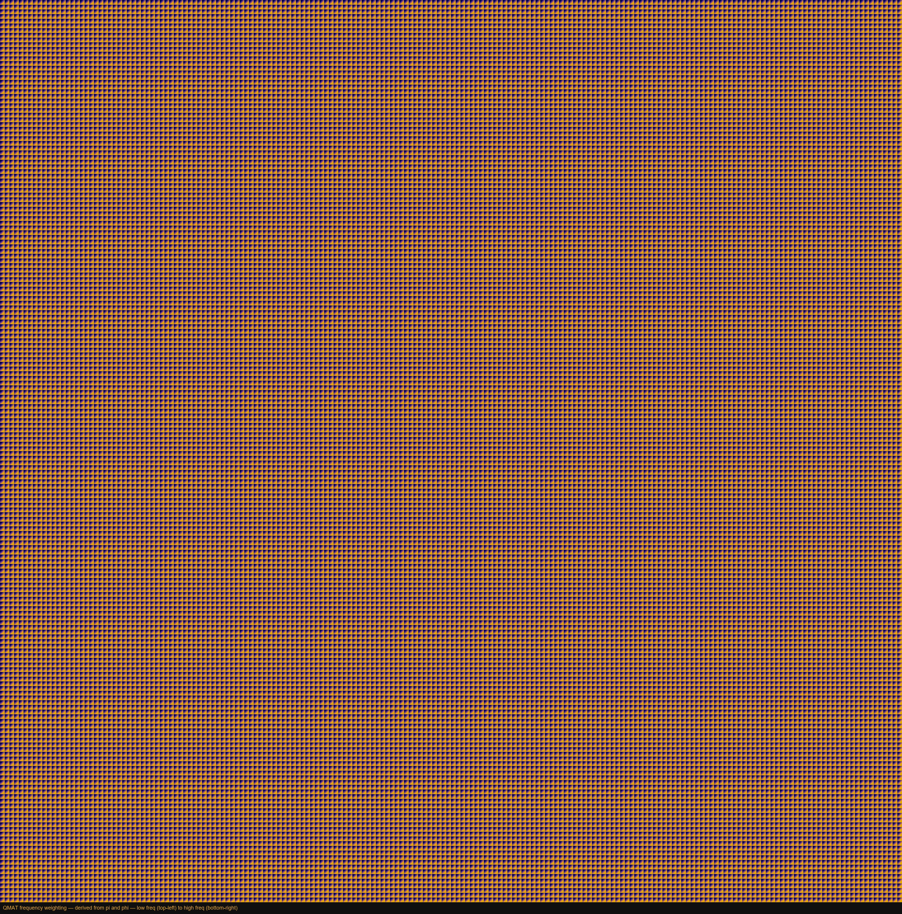
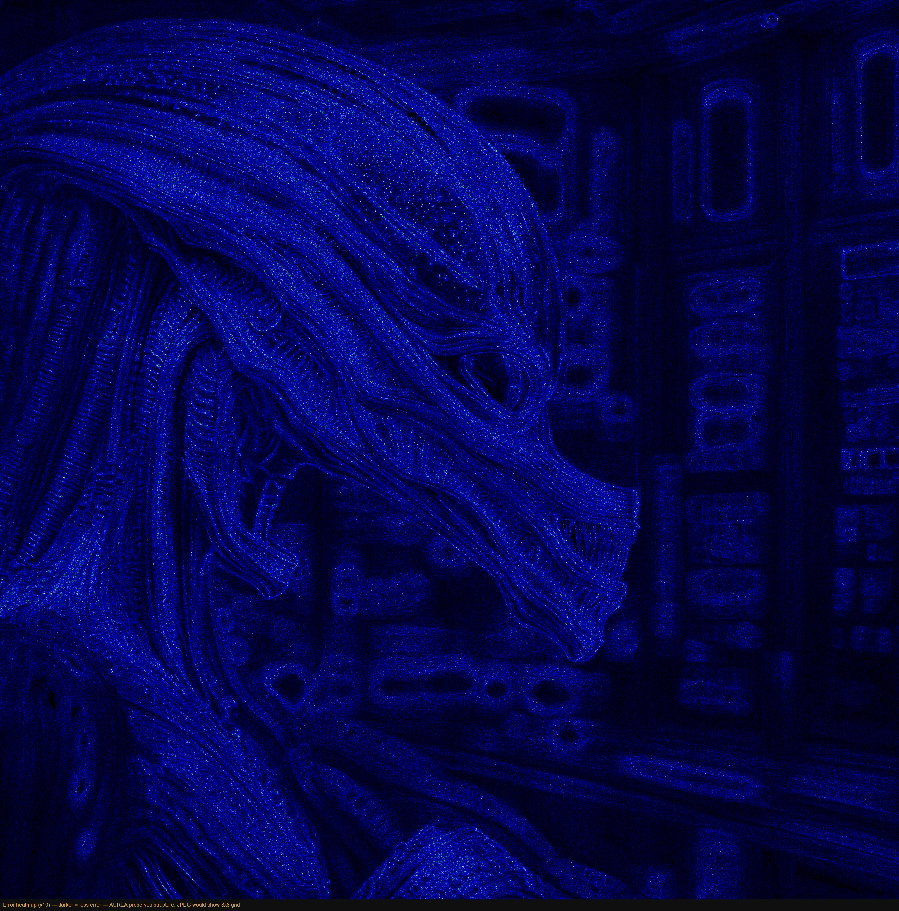

# AUREA v13 — The Encoding Pipeline

### A golden-ratio image codec that beats JPEG

---

## Key Metrics

| Metric | Value |
|--------|-------|
| **BD-Rate vs JPEG (Kodak 24)** | **-14.4%** (24/24 wins) |
| **BD-Rate vs JPEG (HD images)** | **-16.9%** (6/6 wins) |
| **LPIPS perceptual fidelity** | Wins **21/24** at equal file size |
| **DISTS structure fidelity** | Wins **22/24** at equal file size |
| **Chroma resolution** | Full **4:4:4** (JPEG uses 4:2:0) |
| **Encode speed (1920x1280)** | **780 ms** |
| **Max resolution** | 65,535 x 65,535 px |
| **Language** | Rust, multithreaded (rayon) |

---

## Source Image



---

## Stage 1 — Golden Color Transform (GCT)

The image enters a color space built entirely from the golden ratio:

```
L = (R + phi * G + phi^-1 * B) / (2 * phi)
```

Green gets the phi weight (0.500), red gets phi^-2 (0.309), blue gets 1-phi^-1 (0.191). This single constant decorrelates the three channels so effectively that AUREA encodes **all three at full resolution** (4:4:4) — no color subsampling, no chroma bleeding. JPEG throws away 75% of color data. AUREA keeps it all.



*Left: Luminance L (phi-weighted). Center: Chroma C1 (blue-yellow). Right: Chroma C2 (red-cyan). All at full resolution.*

---

## Stage 2 — Perceptual Transfer Function

A **gamma 0.65 correction** expands dark levels, ensuring that quantization noise is invisible where the human eye is most sensitive (Weber-Fechner law).



*Left: Before PTF. Right: After PTF — dark regions are expanded, bright regions slightly compressed.*

---

## Stage 3 — Adaptive LOT Decomposition

The image is divided into blocks of variable size (8x8, 16x16, or 32x32) based on local complexity. Smooth regions merge into larger blocks for better compression. Each block undergoes a **Lapped Orthogonal Transform** — a windowed DCT that overlaps with its neighbors, eliminating blocking artifacts.


*Green grid: 16x16 blocks (standard). Blue regions: 32x32 blocks (smooth areas merged for efficiency).*

---

## Stage 4 — DC Grid

The DC coefficient of each block (its average brightness) forms a low-resolution "thumbnail" of the image. This grid is predicted via **golden-weighted DPCM** and compressed by rANS v12.



*One value per 16x16 block — the structural backbone of the compressed image.*

---

## Stage 5 — Turing Morphogenesis (Zero-Bit Saliency)

This is AUREA's most distinctive innovation. Alan Turing's 1952 model of biological pattern formation is applied to the DC grid:

1. **Sobel** detects edges
2. Two **Gaussian blurs** at scales sigma and sigma * phi^2 create an Activator and Inhibitor
3. **Difference of Gaussians** reveals structural ridges
4. The field modulates quantization: edges get finer steps, smooth areas get coarser

**This costs zero bits.** The decoder computes the identical field from the already-decoded DC.



*The Turing field — golden crests mark edges (more bits invested), dark valleys mark smooth areas (bits saved).*



*Turing field overlaid on the image — the codec "sees" the structure and adapts quantization accordingly.*

---

## Stage 6 — Multi-Factor AC Quantization

Each AC coefficient receives a unique quantization step, computed from **6 multiplicative factors**: QMAT (derived from pi and phi), CSF, foveal saliency, Turing modulation, dead zone, and chroma factor. The QMAT is a parametric matrix — no magic numbers, just fundamental constants.



*The QMAT tiled across the image — low frequencies (top-left of each tile) get fine quantization, high frequencies (bottom-right) get coarser.*

---

## Stage 7 — Result

Five parallel rANS streams compress DC, AC, EOB positions, CfL metadata, and block map. The result:


*AUREA q=75 decoded — visually indistinguishable from the original.*

---

## Error Analysis



*Amplified error (x10) — almost entirely dark blue = near-perfect reconstruction. No 8x8 grid artifacts (unlike JPEG). Structure is preserved, noise is suppressed.*

---

## The Comparison

```
Original JPEG pipeline:     RGB -> YCbCr 4:2:0 -> 8x8 DCT -> QMAT -> Huffman
AUREA v13 pipeline:         RGB -> GCT 4:4:4 -> LOT 8/16/32 -> Turing -> 6-factor quant -> CfL -> rANS

JPEG:   40 years old. Fixed blocks. Huffman tables. Color bleeding.
AUREA:  Built on phi, pi, and Turing. Adaptive everything. Zero bleeding.
        -14.4% smaller. 21/24 perceptually better. Full color.
```

---

*AUREA v13 — The Natural Codec*
*github.com/5ymph0en1x/Aurea*
